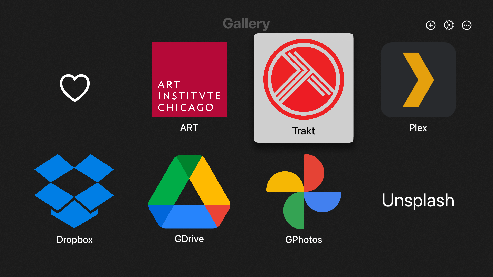

# aBackdrop.app
A digital frame for Apple TV and iOS

## Preview
[Demo preview on YouTube](https://youtu.be/eZVHZJKGWbs)

<!-- <iframe width="560" height="315" src="https://www.youtube.com/embed/eZVHZJKGWbs" title="YouTube video player" frameborder="0" allow="accelerometer; autoplay; clipboard-write; encrypted-media; gyroscope; picture-in-picture" allowfullscreen></iframe> -->

## About

[Apple TestFlight]( https://testflight.apple.com/join/IuCS9G8K)

[Telegram group](https://t.me/+vtlADdgU3kcyZTNl)

App Store

#### Apple TV

Trakt: backdrops and posters

Plex

Google Photos

Dropbox

Unsplash

Art

#### iPad

#### iPhone

<!-- ### YouTube video -->

## Features
- Native SwiftUI
- Various photo/image services

## To Do
- [ ] sync your favorite list
- [] Google drive/photos
- [] more image sources, e.g., Pixiv, Pinterest
- [x]

## Privacy Policy 
What user data your app collects
[to do]

How you collect user data

How you use user data

Whether you only share user data with companies that have good privacy practices

How long you retain user data

How your users can revoke consent

How your users can request you delete their user data

## Term of use

[to do]